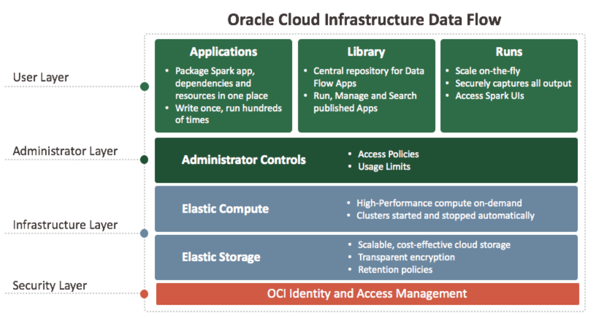

# 02 - Layanan Cloud

## Tujuan Pembelajaran

1. Mengetahui layanan yang ditawarkan cloud computing khususnya Oracle Cloud
Infrastructure (OCI)

## Tugas 5 Layanan Oracle Cloud

### Layanan 1: AUDIT

Layanan Audit Infrastruktur Oracle Cloud secara otomatis merekam panggilan ke semua titik akhir antarmuka pemrograman aplikasi publik (API) Oracle Cloud Infrastructure yang didukung sebagai peristiwa log. Saat ini, semua layanan mendukung logging oleh Audit. Layanan Object Storage mendukung logging untuk event terkait bucket, tetapi tidak untuk event terkait objek. Peristiwa log yang direkam oleh layanan Audit mencakup panggilan API yang dibuat oleh Oracle Cloud Infrastructure Console, Command Line Interface (CLI), Software Development Kits (SDK), klien kustom Anda sendiri, atau layanan Oracle Cloud Infrastructure lainnya. Informasi dalam log mencakup hal-hal berikut: Waktu aktivitas API terjadi, Sumber kegiatan, Sasaran kegiatan, Jenis Tindakan, Jenis respons.

### Layanan 2: DATA FLOW

Oracle Cloud Infrastructure Data Flow adalah layanan terkelola sepenuhnya untuk menjalankan aplikasi Apache Spark ™. Ini memungkinkan pengembang untuk fokus pada aplikasi mereka dan menyediakan lingkungan runtime yang mudah untuk menjalankannya. Ini memiliki antarmuka pengguna yang mudah dan sederhana dengan dukungan API untuk integrasi dengan aplikasi dan alur kerja.

Dafa Flow Concepts:
* Data Flow Applications, Aplikasi adalah templat Spark Application yang dapat digunakan kembali tanpa batas yang terdiri dari Spark Application, dependensinya, parameter default, dan spesifikasi sumber daya run-time default. Setelah pengembang membuat Aplikasi Aliran Data, siapa pun dapat menggunakannya tanpa mengkhawatirkan kerumitan penerapannya, pengaturannya, atau menjalankannya.
* Data Flow Library, The library adalah pusat penyimpanan Aplikasi Aliran Data. Siapa pun dapat menelusuri, mencari, dan menjalankan aplikasi yang diterbitkan ke library, dengan syarat memiliki izin yang benar dalam sistem Aliran Data.
* Data Flow Runs, Setiap kali Aplikasi Data Flow dijalankan, Run dibuat. Data Flow Run menangkap keluaran, log, dan statistik Aplikasi yang disimpan secara otomatis dengan aman. Output disimpan sehingga dapat dilihat oleh siapa saja dengan izin yang benar menggunakan UI atau REST API. Berjalan memberi Anda akses aman ke Spark UI untuk debugging dan diagnostik.
* Elastic Compute, Setiap kali Anda menjalankan Aplikasi Data Flow, Anda memutuskan seberapa besar yang Anda inginkan. Aliran Data mengalokasikan VM Anda, menjalankan tugas Anda, menangkap semua output dengan aman, dan mematikan kluster. Anda tidak memiliki apa pun untuk dipertahankan di Data Flow. Cluster hanya berjalan ketika ada pekerjaan nyata yang harus dilakukan.
* Elastic Storage, Data Flow bekerja dengan layanan Oracle Cloud Infrastructure Object Storage.
* Security, Data Flow terintegrasi dengan Oracle Cloud Infrastructure Identity and Access Management (IAM) untuk otentikasi dan otorisasi. Spark Application Anda berjalan atas nama orang yang meluncurkannya. Ini berarti bahwa Spark Application memiliki hak istimewa yang sama dengan yang dimiliki pengguna akhir. Anda tidak perlu menggunakan kredensial untuk mengakses sistem yang mendukung IAM. Selain itu, Data Flow mendapat manfaat dari semua atribut keamanan lain dari Oracle Cloud Infrastructure termasuk enkripsi transparan data saat diam dan bergerak.
* Administrator Controls, Data Flow memungkinkan Anda untuk menetapkan batas layanan, dan membuat administrator yang memiliki kontrol penuh atas semua aplikasi dan berjalan. Anda memegang kendali terlepas dari berapa banyak pengguna yang Anda miliki.
* Apache Spark, Apache Spark adalah mesin analitik terpadu untuk pemrosesan data besar, dengan modul bawaan untuk streaming, SQL, pembelajaran mesin, dan pemrosesan grafik.
* Spark Application, Spark Application menggunakan Spark API untuk melakukan tugas pemrosesan data terdistribusi. Spark Application dapat ditulis dalam beberapa bahasa termasuk Java, Python, dan lainnya. Spark Application memanifestasikan dirinya sebagai file seperti file JAR yang dieksekusi dalam kerangka kerja Spark.
* Spark UI, Spark UI disertakan dengan Apache Spark dan merupakan alat penting untuk men-debug dan mendiagnosis aplikasi Spark. Anda dapat mengakses Spark UI untuk Data Flow Run apa pun, dengan tunduk pada kebijakan otorisasi Run.
* Spark Logs, Spark menghasilkan file Spark Log yang berguna untuk debugging dan diagnostik. Setiap Data Flow Run secara otomatis menyimpan file log yang dapat Anda akses melalui UI atau API, tunduk pada kebijakan otorisasi Run.

### Layanan 3: DATA INTEGRATION

Data Integration adalah layanan multi-penyewa yang terkelola sepenuhnya yang membantu insinyur data dan pengembang ETL dengan tugas-tugas ekstrak, transformasi, dan pemuatan (ETL) umum seperti menyerap data dari berbagai aset data; membersihkan, mengubah, dan membentuk kembali data tersebut; dan memuatnya secara efisien ke aset data target.

Data Integration Concepts:
* Workspace, Wadah untuk semua sumber daya Integrasi Data, seperti proyek, folder, aset data, tugas, aliran data, jalur pipa, aplikasi, dan jadwal, yang terkait dengan solusi integrasi data.
* Project, Wadah untuk sumber daya waktu desain, seperti tugas atau aliran data dan jalur pipa.
* Folder, Wadah dalam proyek atau folder lain untuk mengatur sumber daya waktu desain Anda.
* Data Asset, Mewakili sumber data seperti database, penyimpanan objek, file atau penyimpanan dokumen yang berisi metadata sumber data dan detail koneksi.
* Connection, Mencakup detail yang diperlukan untuk membuat koneksi ke sumber data. Koneksi selalu dikaitkan dengan satu aset data. Aset data dapat memiliki lebih dari satu koneksi.
* Data Entity, Kumpulan data, seperti tabel atau tampilan database, atau file logika tunggal, dengan banyak atribut yang menjelaskan datanya.
* Schema, Kumpulan entitas data dalam aset data.
* Data Flow, Sebuah sumber daya desain-waktu yang mendefinisikan Data Flow dan setiap operasi pada data antara sumber dan sistem target. Untuk menjalankan Data Flow, Anda menambahkan Data Flow ke tugas integrasi.
* Pipeline, Sumber daya desain-waktu untuk mengatur tugas dan aktivitas dalam urutan atau paralel untuk memfasilitasi proses dari awal hingga akhir. Untuk menjalankan pipeline, Anda menambahkan pipa ke tugas pipeline.
* Operator, Operator mewakili sumber input atau target output, atau transformasi dalam aliran data. Dalam pipa, operator mewakili tugas yang diterbitkan atau aktivitas seperti menggabungkan atau akhir.
* Parameter, Tipe variabel yang bisa Anda tetapkan ke detail operator sehingga Anda bisa menggunakan kembali aliran data atau desain saluran dengan sumber daya dan nilai yang berbeda. Saat Anda menggunakan parameter dan menetapkan nilai default selama waktu desain, Anda bisa mengubah nilai nanti, baik dalam tugas yang membungkus aliran data atau saluran, atau saat Anda menjalankan tugas.
* Task, Sumber daya desain-waktu yang menentukan serangkaian tindakan untuk dilakukan pada data. Anda dapat membuat tugas pemuat data, tugas integrasi untuk aliran data, dan tugas pipeline untuk pipeline. Anda juga dapat membuat tugas SQL dan tugas Aliran Data OCI. Untuk menjalankan tugas, Anda memublikasikan tugas ke dalam Aplikasi untuk mengujinya atau meluncurkannya ke produksi.
* Application, Wadah untuk artefak runtime, seperti tugas yang telah diterbitkan bersama dengan dependensinya. Anda menggunakan Aplikasi untuk pengujian dan akhirnya meluncurkannya ke dalam produksi.
* Patch, Pembaruan untuk Aplikasi. Saat Anda menerbitkan satu tugas atau sekelompok tugas, atau saat Anda membatalkan publikasi tugas, aktivitas ini dicatat sebagai tambalan di Aplikasi. Saat Anda membuat Aplikasi (target) dengan membuat salinan sumber daya yang ada di Aplikasi (sumber) lain, patch ditambahkan ke Aplikasi (target). Dalam penyegaran berikutnya dari Aplikasi target dengan menyinkronkan dengan perubahan dari Aplikasi sumber, tambalan juga dibuat di Aplikasi (target).
* Run, Artefak runtime yang mewakili pelaksanaan tugas.
* Schedule, Sumber daya runtime yang menentukan kapan dan seberapa sering tugas yang diterbitkan harus dijalankan secara otomatis.
* Task Schedule, Sumber daya runtime yang terkait dengan tugas tertentu yang diterbitkan dan jadwal yang ada untuk menentukan kapan dan seberapa sering tugas harus dijalankan secara otomatis.

### Layanan 4: DNS and TRAFFIC MANAGEMENT

* DNS
---
Layanan DNS membantu Anda membuat dan mengelola zona DNS Anda.Traffic Management membantu Anda memandu lalu lintas ke titik akhir Anda berdasarkan berbagai kondisi, termasuk kondisi titik akhir dan asal geografis permintaan DNS.

* DDoS Protection
---
DDoS Protection adalah platform deteksi dan mitigasi yang selalu aktif untuk serangan volumetrik DDoS umum. Layanan ini melindungi terhadap serangan lapisan 3 dan 4 yang umum seperti banjir SYN, banjir UDP, banjir ICMP, dan serangan Amplifikasi NTP. Perlindungan DDoS disertakan dengan semua akun Oracle Cloud Infrastructure dan tidak diperlukan konfigurasi atau pemantauan.

DNS Service Components:
* DOMAIN, Nama domain mengidentifikasi lokasi tertentu atau kelompok lokasi di Internet secara keseluruhan. Definisi umum "domain" adalah bagian lengkap dari pohon DNS yang telah didelegasikan ke kontrol pengguna. Misalnya, example.com atau oracle.com.
* ZONE, Zona adalah bagian dari namespace DNS. Start of Authority record (SOA) mendefinisikan sebuah zona. Zona berisi semua label di bawahnya sendiri di pohon, kecuali ditentukan lain.
* LABEL, Label ditambahkan ke nama zona, dipisahkan oleh titik, untuk membentuk nama subdomain. Misalnya, bagian "www" dari www.example.com atau bagian "docs" dan "us-ashburn-1" dari docs.us-ashburn-1.oraclecloud.com adalah label. Catatan terkait dengan domain ini.
* CHILD ZONE, CHILD ZONE adalah subdomain independen dengan catatan Mulai Otoritas dan Server Nama (NS) mereka sendiri. Zona induk CHILD ZONE harus berisi catatan NS yang merujuk kueri DNS ke server nama yang bertanggung jawab untuk CHILD ZONE. Setiap CHILD ZONE berikutnya membuat tautan lain dalam rantai delegasi.
* RESOURCE RECORDS, Sebuah record berisi informasi domain tertentu untuk sebuah zona. Setiap jenis record berisi informasi yang disebut record data (RDATA). Misalnya, RDATA catatan A atau AAAA berisi alamat IP untuk nama domain, sedangkan data MX berisi informasi tentang server email untuk domain. OCI menormalkan semua RDATA ke dalam format yang paling dapat dibaca mesin. Presentasi yang dikembalikan dari RDATA Anda mungkin berbeda dari input awalnya. Untuk informasi lebih lanjut tentang RDATA, silakan lihat Jenis Catatan Sumber Daya DNS yang Didukung.
* DELEGATION, Server nama tempat DNS Anda dihosting dan dikelola.

### Layanan 5: OS MANAGEMENT
Layanan Oracle Cloud Infrastructure OS Management memungkinkan Anda untuk mengelola dan memantau pembaruan dan patch untuk lingkungan sistem operasi pada instans Oracle Cloud Anda, termasuk instans yang dikelola oleh layanan Oracle Autonomous Linux. Manajemen OS juga menyediakan opsi untuk menemukan dan memantau sumber daya pada instans Anda.

OS Management Components and Features:
* Managed Instance, Instans Compute yang menggunakan layanan Manajemen OS disebut sebagai instans terkelola.
* Managed Instance Groups, instance Groups terkelola memungkinkan Anda untuk mengelompokkan instance bersama-sama untuk pembaruan.
* OS Management Service Agent Plugin, Manajemen OS menggunakan plugin Agen Layanan Manajemen OS untuk mengelola dan menerapkan pembaruan. Oracle Cloud Agent mengelola plugin OS Management Service Agent. Untuk informasi selengkapnya tentang Oracle Cloud Agent, lihat Mengelola Plugin dengan Oracle Cloud Agent.
    * Untuk instans Oracle Linux, plugin Agen Layanan Manajemen OS menggunakan izin Linux standar untuk akun administratif sudo untuk menerapkan pembaruan.
    * Untuk instans Windows, plugin Agen Layanan Manajemen OS membuat akun layanan virtual untuk menerapkan pembaruan pada instans. Akun layanan virtual adalah OCAOSMS. Jangan hapus akun ini pada saat layanan Manajemen OS digunakan.
* Software Sources, Untuk instans Linux, Manajemen OS menggunakan Software Sources  lunak untuk menyediakan paket ke instans dan untuk melacak pembaruan yang tersedia untuk paket tersebut.
* Linux Package Management, Untuk instans Linux, Manajemen OS menyediakan fasilitas pencarian yang dapat Anda gunakan untuk memeriksa paket individual. Dengan menggunakan fasilitas pencarian ini, Anda dapat memeriksa pembaruan yang tersedia. Anda juga dapat menggunakan fasilitas ini untuk melakukan tindakan untuk mengelola paket Linux, seperti menginstal, menghapus, dan memperbarui paket pada instance terkelola dan grup instance terkelola.
* Windows Update Management, Untuk instans Windows, Manajemen OS menyediakan tindakan untuk menginstal pembaruan Windows pada instans terkelola dan grup instans terkelola.
* Common Vulnerabilities and Exposures (CVE) Search, Untuk instans Linux, Manajemen OS menyediakan fasilitas pencarian yang dapat Anda gunakan untuk memeriksa CVE individu. Fasilitas ini membantu Anda menentukan tingkat eksposur dalam sewa Anda.
* Oracle Autonomous Linux, Oracle Autonomous Linux adalah layanan terkelola untuk mengurangi kompleksitas dan overhead tugas manajemen OS umum.
* Scheduled Jobs, Saat Anda menggunakan layanan Manajemen OS untuk mengelola pembaruan pada instans terkelola atau grup instans terkelola, Anda memiliki kontrol penuh atas saat tindakan dilakukan. Jika Anda menentukan bahwa suatu tindakan terjadi pada tanggal dan waktu tertentu, layanan Manajemen OS membuat pekerjaan terjadwal. Manajemen OS menyediakan dua mode dasar untuk pekerjaan terjadwal: pekerjaan satu kali dan pekerjaan berulang.
* Work Requests, Tindakan Manajemen OS seperti menginstal, menghapus, atau memperbarui paket tidak sinkron dan memulai permintaan kerja. Anda dapat menggunakan permintaan kerja untuk melacak status operasi, termasuk kemampuan untuk melihat mengapa suatu tindakan gagal.

