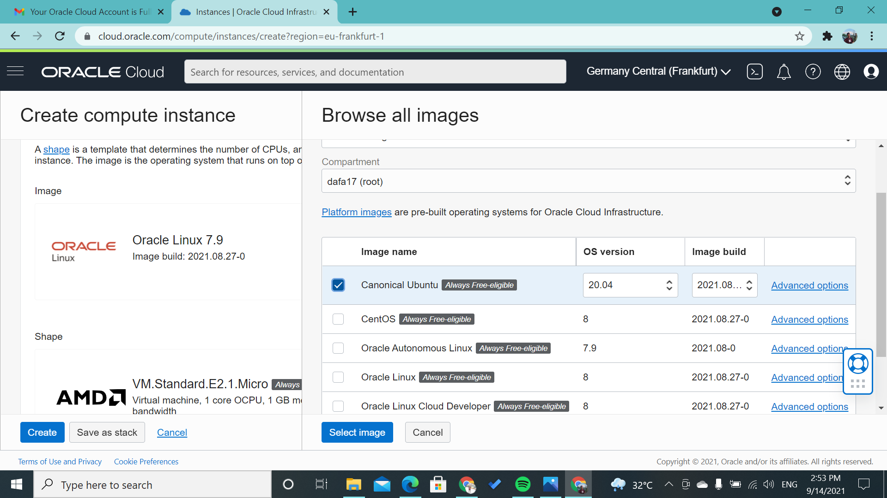

# 03 - Membuat Virtual Machine

## Tujuan Pembelajaran

1.  Mengetahui layanan Oracle Cloud Infrastructure Compute
2.   Mampu membuat Virtual Machine (VM) di layanan compute Oracle Cloud
3. Dapat melakukan koneksi ke server dengan SSH.

## Hasil Praktikum

Berikut ini adalah bukti telah berhasil membuat VM:

* Langkah 1

Penjelasan: pada bagian side bar klik compute lalu setelah itu klik instance.
---
* Langkah 2

Penjelasan: pada langkah inilangsung saja kita klik create instance. jika tombol create instance tidak muncul pada bagian side bar -> List Scope -> Compartment, lalu ubah compartment nya menjadi akun anda.
---
* Langkah 3

Penjelasan: pada langkah ke 3 ini kita mengganti image yang awalnya linux oracle menjadi Cannical Ubuntu lalu klik save.
---
* Langkah 4

Penjelasan: ini adalah bagian detail dari pembuatan instance
---
* Langkah 5

Penjelasan: ini adalah bagian jika instance sudah berhasil di buat, di kasus berbeda laptop status succeeded lama sekali munculnya, langkah yang harus di ambil ialah refresh page browser dan cek kembali status nya.
---
* Langkah 6

Penjelasan: berikut tampilan ketika VM berhasil dibuat dan Running, pada bagian yang bawah terdapat VM dengan state "TERMINATED" Vm itu saya hapus lantaran saya salah memasukkan image VM.
---
## Connecting SSH windows ke server dengan menggunakan PUTTY

* Langkah 1
Buka Putty gen terlebih dahulu lalu load SSH Key yang sudah di dwonload dan berinama sesuka hati untuk penamaan ssh key yang di conver menjadi format .ppk

* Langkah 2
buka PUTTY lalu pada bagian category, klik session lalu ketikkan username@ip public dengan port 22 dan connection SSH.

* Langkah 3
pada bagian category expand window dan klik bagian translation, pada bagian remote character set pilih UTF-8.

* Langkah 4
pada bagian category expand connection lalu expand lagi ssh dan klik bagian auth, pada bagian auth brows dan arahkan ke file yang sudah di convert ke .ppk

Klik Accept
