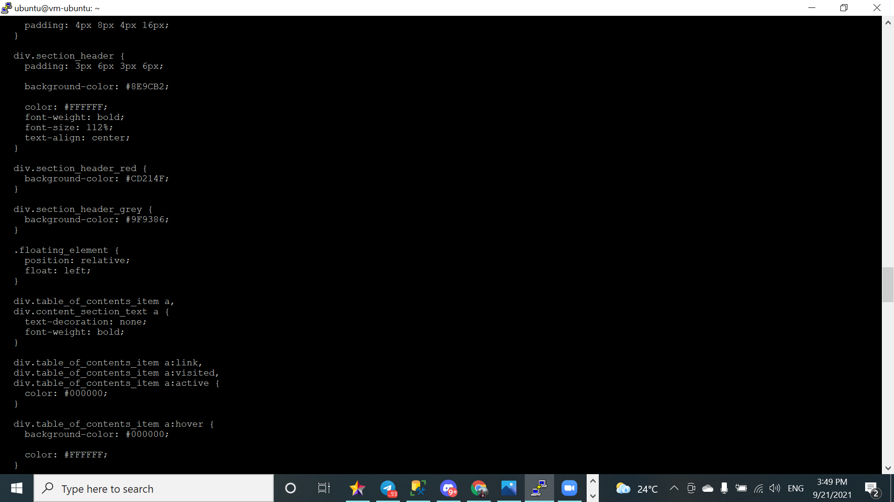

# 04 - Virtual Cloud Network (VCN)

## Tujuan Pembelajaran

1. Mengetahui layanan Oracle Cloud Infrastructure Networking
2. Mampu mengaktifkan port 80 melalui Virtual Cloud Network (VCN) di layanan 
Oracle Cloud
3. Mampu memasang Apache server dan mengonfigurasi IP tables Firewalls

# Hasil Praktikum

Berikut ini adalah dokumentasi praktikum VCN.

---
## Praktikum 1
### Langkah 1
Login ke akun oracle terlebih dahulu.
### Langkah 2
Setelah berhasil login dan ada di beranda Oracle Cloud akun Anda, silakan pilih 
menu di pojok kiri atas, lalu pilih menu Networking > Virtual Cloud Networks

### Langkah 3
Pastikan VCN sudah ada, biasanya jika berhasil telah membuat VM dari modul 
pertemuan sebelumnya maka VCN akan tampil di sini. Silakan klik nama VCN tersebut.

### Langkah 4
Pilih Security Lists di panel kiri (Resources), lalu pilih Default Security List di tabel yang tersedia.

### Langkah 5
Klik tombol biru Add Ingress Rules untuk menambahkan port.

Isilah ingress rule dengan nilai-nilai seperti gambar di atas atau teks berikut:
Stateless: Checked
Source Type: CIDR
Source CIDR: 0.0.0.0/0
IP Protocol: TCP
Source port range: (biarkan kosong)
Destination Port Range: 80
Description: Allow HTTP connection
Terakhir, klik tombol Add Ingress Rules. Sekarang koneksi HTTP telah diizinkan. VCN Anda 
telah dikonfigurasi untuk Apache server.
Anda telah sukses membuat ingress rule yang berfungsi untuk membuka port 80 HTTP server 
VM Anda agar bisa diakses oleh publik.

---

## Praktikum 2: Setup Apache di VM
### Langkah 1
Buka instance Anda melalui menu Compute > Instances, kemudian copy IP public VM yang ingin kita akses untuk diatur web server Apache.
### Langkah 2
Lakukan akses ke VM dengan mengoneksikan Vm dan komputer anda dengan powershell ataupun putty. disini saya mengoneksikan menggunakan putty dan untuk langkahnya sama seperti yang ada pada tugas Jobsheet sebelumnya(Jobsheet 3).
### Langkah 3
Setelah terkoneksi dengan VM Anda, silakan lakukan perintah berikut baris 
demi baris untuk menginstall Apache server.   
sudo apt update

sudo apt -y install apache2

### Langkah 4
Jalankan service Apache dengan perintah berikut.    
sudo systemctl restart apache2

### Langkah 5
Secara default pada VM Ubuntu kita untuk firewall itu statusnya disabled (tidak 
aktif), maka kita perlu mengaktifkannya dengan melakukan update pada iptabels terlebih 
dahulu. Lakukan perintah berikut baris demi baris.                                   
sudo iptables -I INPUT 6 -m state --state NEW -p tcp --dport 80 -j ACCEPT

sudo netfilter-persistent save

### Langkah 6
Sekarang Anda dapat melakukan uji server VM Anda dengan perintah curl 
localhost atau buka browser di komputer/laptop pribadi Anda dan arahkan ke IP public 
VM yang Anda miliki. Seharusnya jika sukses, maka akan tampil seperti gambar berikut ini.

---

## Praktikum 3: Install PHP
dikarenakan kesalahan pada praktikum yaitu tidak melakukan screenshoot pada langkah langkahnya jadi saya hanya bisa memberikan hasil bahwa saya sudah berhasil menginstall PHP pada VM saya.
### Hasil Instalasi
