# 05 - PLATFORM AS A SERVICE (PAAS)

## Tujuan Pembelajaran

1. Mengetahui layanan yang ditawarkan cloud computing khususnya Oracle Cloud 
Infrastructure (OCI)
# Hasil Praktikum

Berikut ini adalah dokumentasi praktikum PAAS.

---
## Praktikum 1
### Langkah 1
Login ke akun oracle terlebih dahulu.
### Langkah 2
setelah login buka side bar lalu pilih menu database dan klik menu MySql.
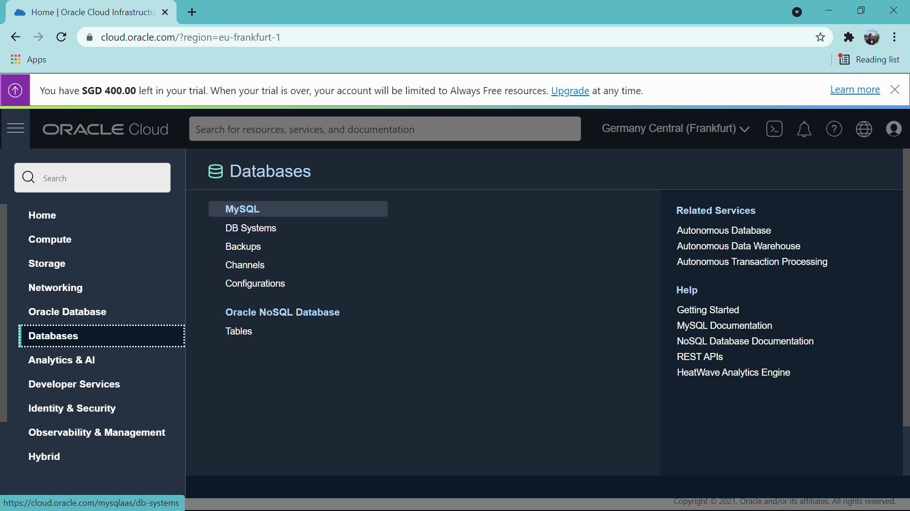
### Langkah 3
lalu klik create MySql DB System 
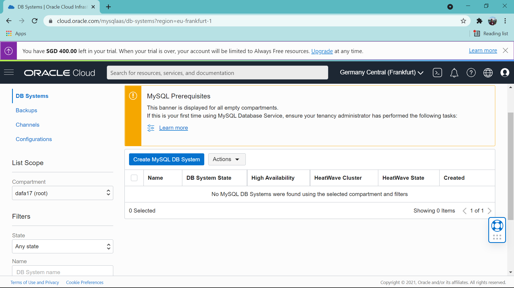
### Langkah 4
stelah itu pilih compartment dan lakukan setup nama DB System.
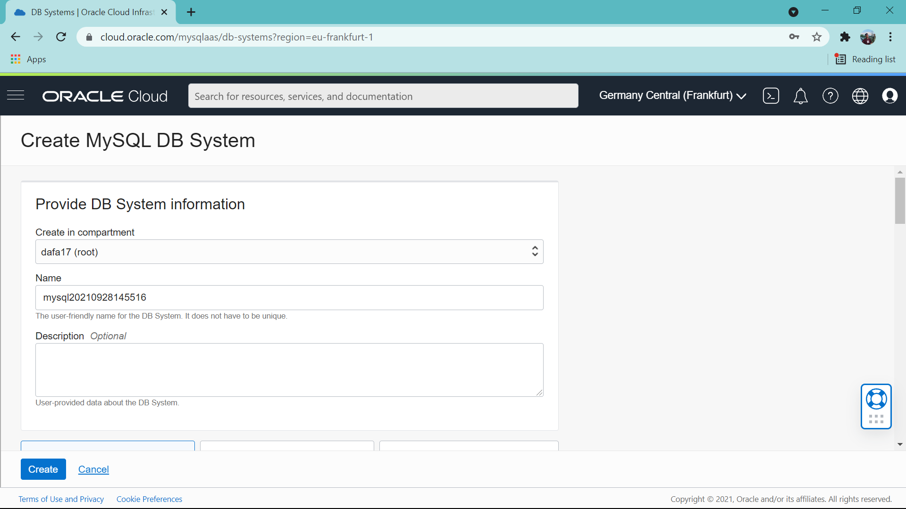
### Langkah 5
pilih standlone single-instance MySql DB System dan create Administrator credentials "usahakan untuk mengingat password" karena password akan digunakan untuk masuk kedalam MySql.
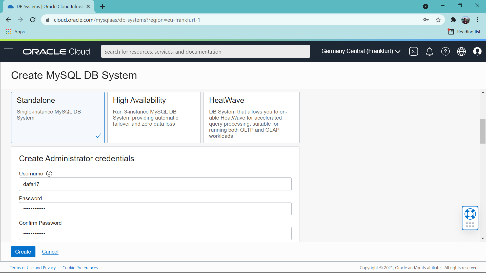
pada bagian di bawah ini biarkan nilainya default lalu klik create.

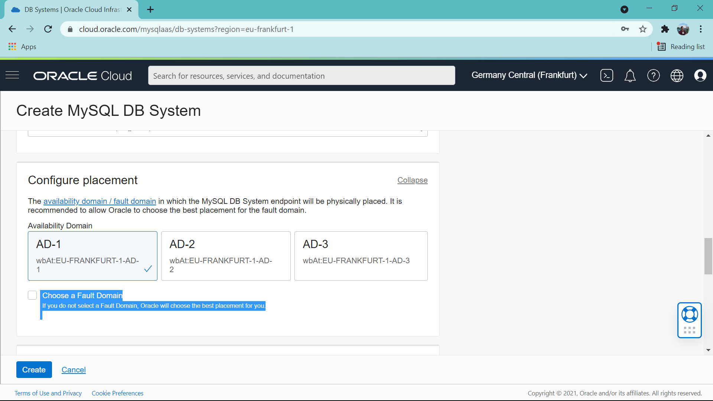
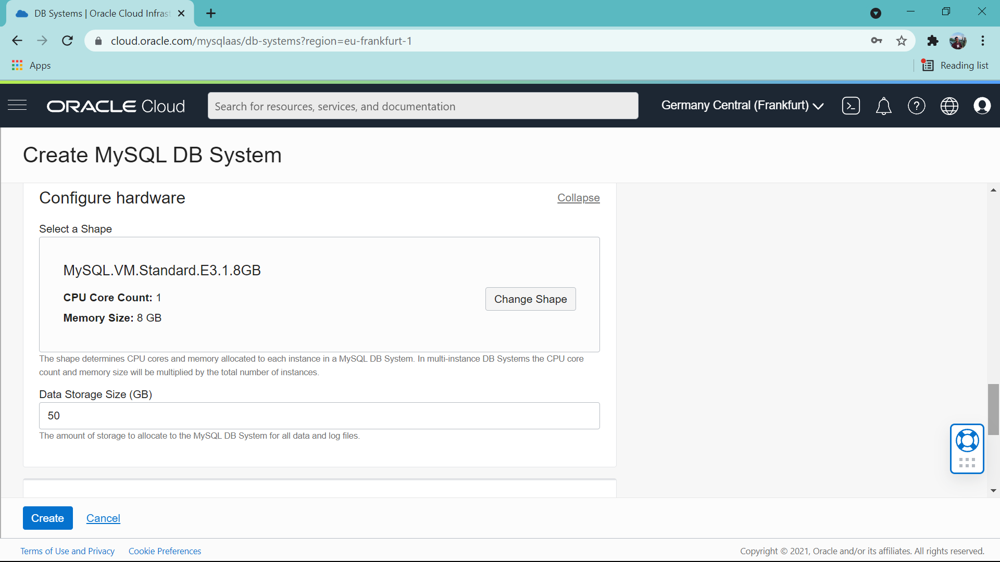
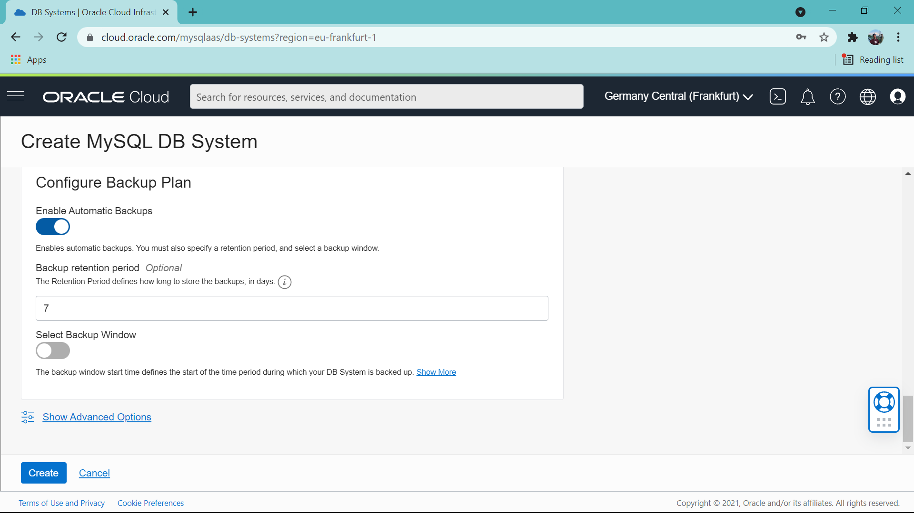
### Langkah 6
jika sudah creating maka akan tampil seperti ini:
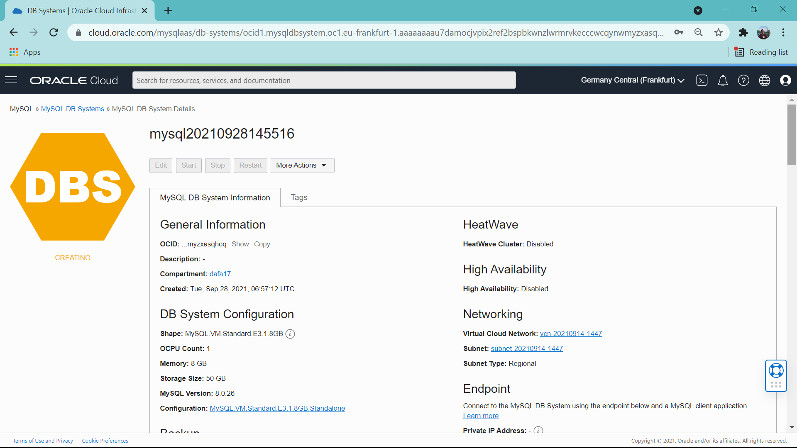
jika status DB Sytem sudah menjadi Actived klik Db System yang tadi kita buat.
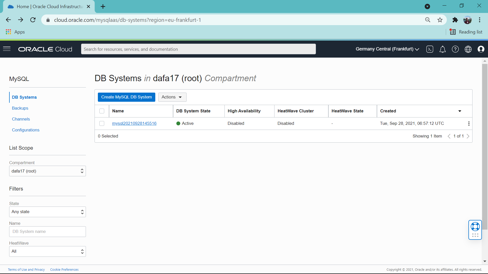
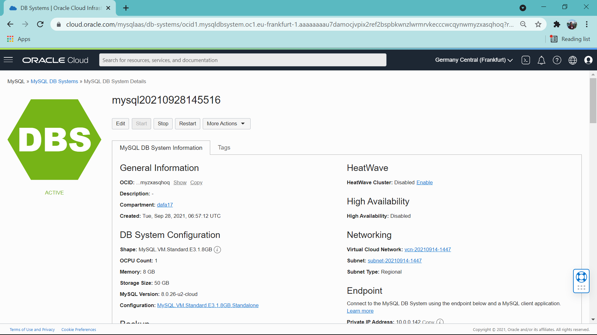
### Langkah 7
langkah selanjutnya klik kembali sidebar lalu klik networkdan pilin VCN dan pastikan VCN sudah available untuk digunakan

lalu klik subnet
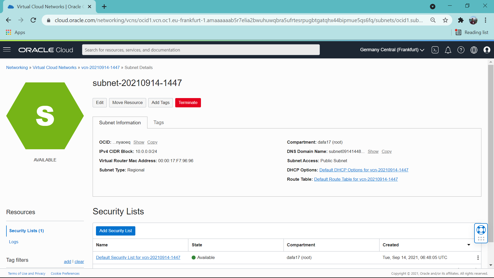
dan klik security list.
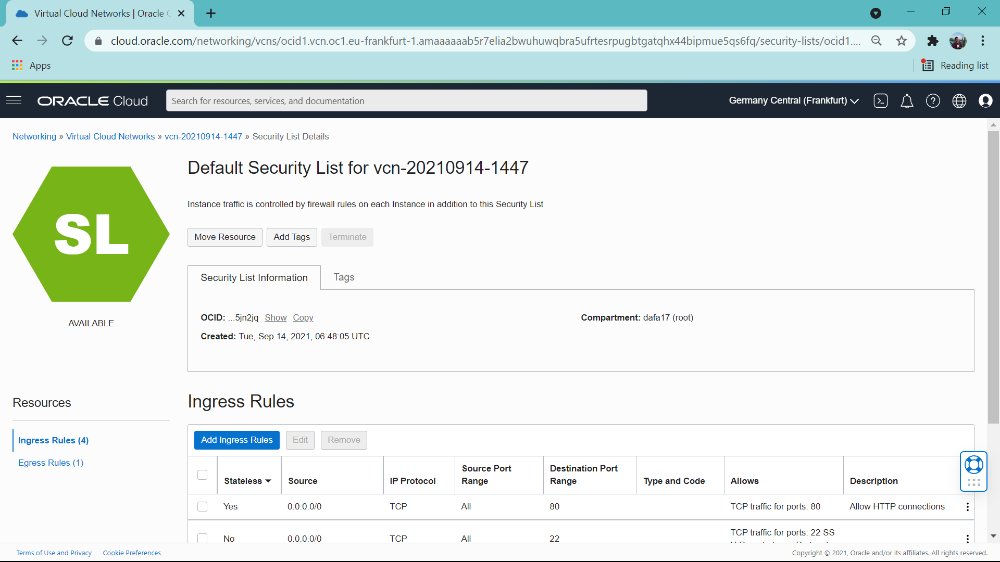
pada bagian ini klik add ingress rules.
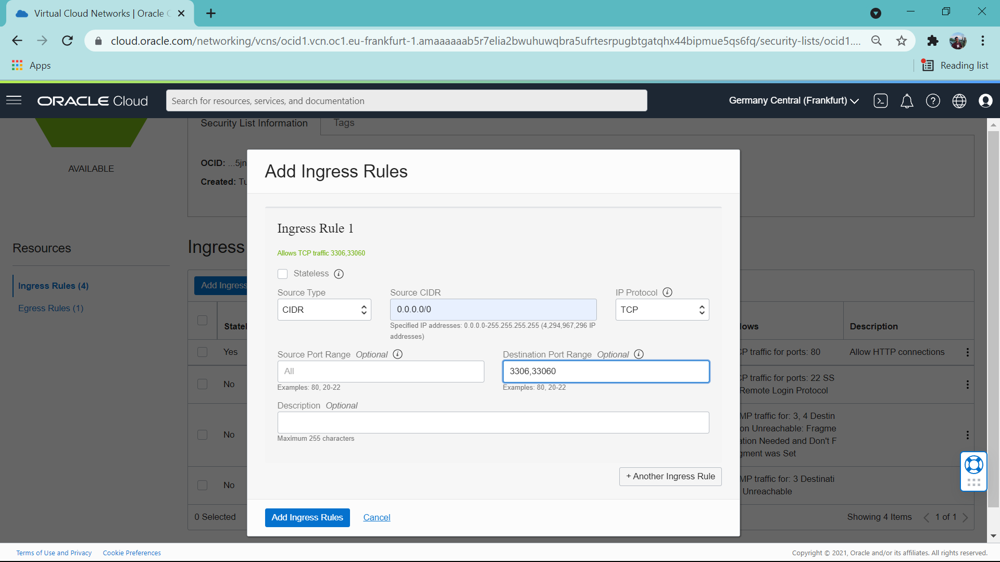
set soource type menjadi CIDR dan source CIDR menjadi 0.0.0.0/0, ip protocol menjadi TCP dan destination port range isi menjadi 3306.33060 lalu klik add ingress rules.
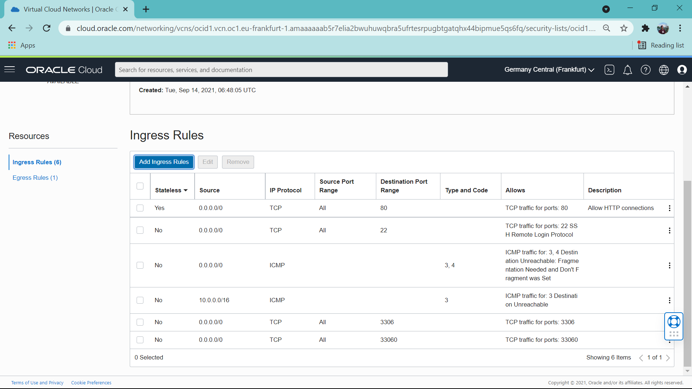

### Langkah 8
lakukan koneksi menggunakan putty dari windows ke VM seperti pada praktikum sebelumnya setelah sudah terkoneksi lakukan instalasi MySql pada VM.
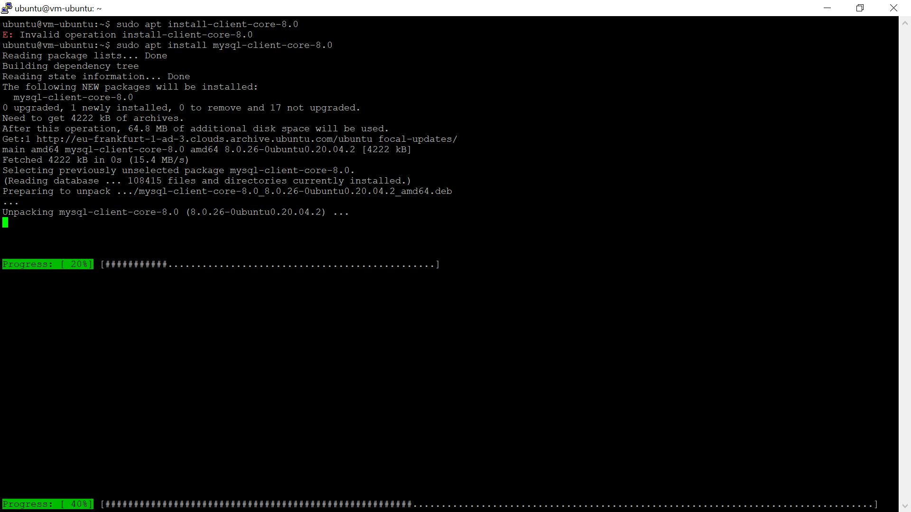
setelah terinstall lakukan login pada MySql dan jika login berhail maka tampilan akan seperti ini:
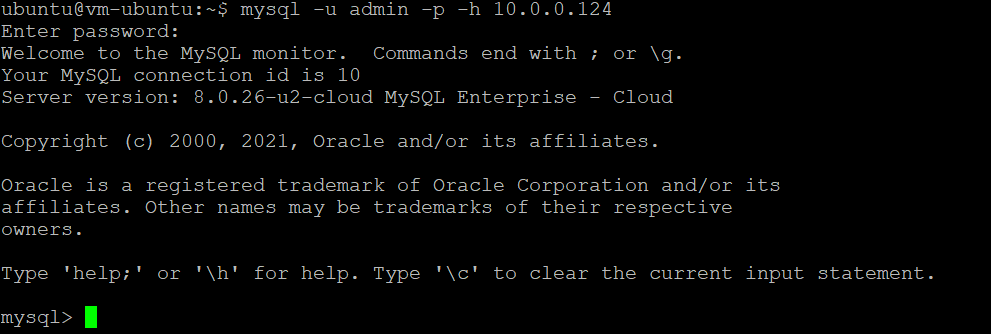