# 05 - PLATFORM AS A SERVICE (PAAS)

## Tujuan Pembelajaran

1. Mengetahui layanan yang ditawarkan cloud computing khususnya Oracle Cloud 
Infrastructure (OCI)
# Hasil Praktikum

Berikut ini adalah dokumentasi praktikum PAAS.

---
## Praktikum 1
### Langkah 1
Login ke akun oracle terlebih dahulu.
### Langkah 2
setelah login buka side bar lalu pilih menu database dan klik menu MySql.

### Langkah 3
lalu klik create MySql DB System 

### Langkah 4
stelah itu pilih compartment dan lakukan setup nama DB System.

### Langkah 5
pilih standlone single-instance MySql DB System dan create Administrator credentials "usahakan untuk mengingat password" karena password akan digunakan untuk masuk kedalam MySql.

pada bagian di bawah ini biarkan nilainya default lalu klik create.
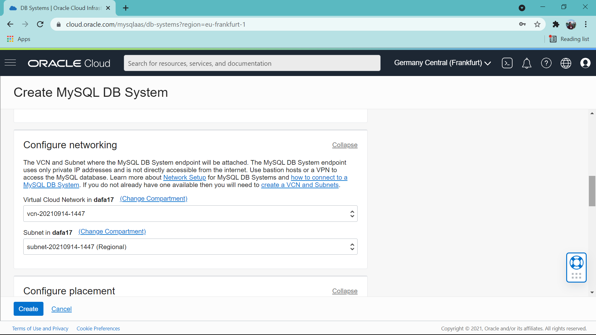

### Langkah 6
jika sudah creating maka akan tampil seperti ini:

jika status DB Sytem sudah menjadi Actived klik Db System yang tadi kita buat.

### Langkah 7
langkah selanjutnya klik kembali sidebar lalu klik networkdan pilin VCN dan pastikan VCN sudah available untuk digunakan
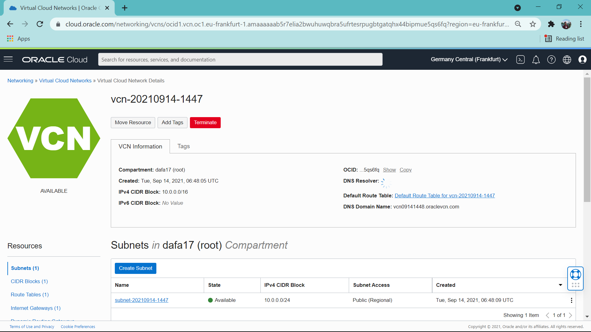
lalu klik subnet

dan klik security list.

pada bagian ini klik add ingress rules.

set soource type menjadi CIDR dan source CIDR menjadi 0.0.0.0/0, ip protocol menjadi TCP dan destination port range isi menjadi 3306.33060 lalu klik add ingress rules.

### Langkah 8
lakukan koneksi menggunakan putty dari windows ke VM seperti pada praktikum sebelumnya setelah sudah terkoneksi lakukan instalasi MySql pada VM.

setelah terinstall lakukan login pada MySql dan jika login berhail maka tampilan akan seperti ini:

---
## MENGINSTALL WORDPRESS Pada PaaS
### Langkah 1
Membuat database: (mysql> create database wordpress;
mysql> show databases;
mysql> grant all privileges on wordpress.* to admin;)

### Langkah 2
Download Wordpress pada folder /var/www/html dengan perintah (wget https://wordpress.org/latest.tar.gs;)
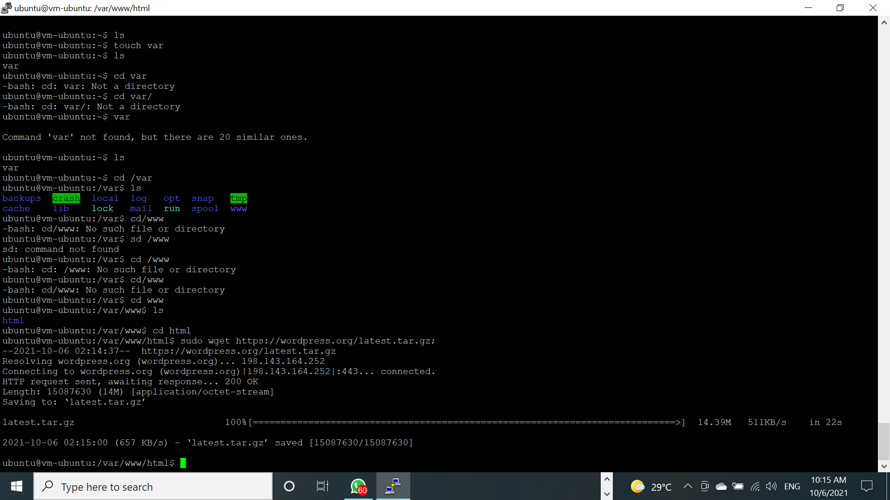

### Langkah 3
Mengestrak wordpress pada folder /var/www/html dengan perintah (tar latest.tar.gz atau sudo tar latest.tar.gz)
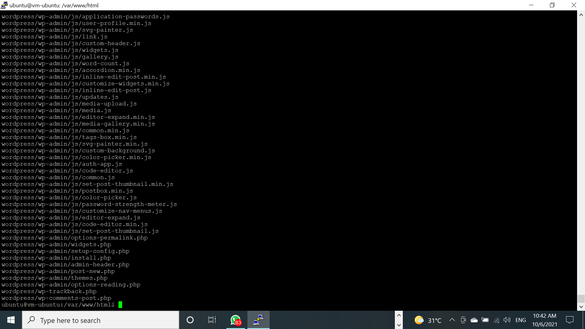
seletah mengekstrak file hasil download dapat dihapus dengan menggunakan perintah (sudo rm rf latest.tar.gz atau sudo rm -rf latest.tar.gz)
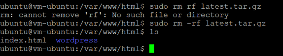

### Langkah 4
Selanjutnya menginstall extension mysql pada php dan mengaktifkannya pada php.ini.
Berikut adalah perintah untuk menginstall extenstion mysql pada php.
(sudo apt-get install php-mysql)
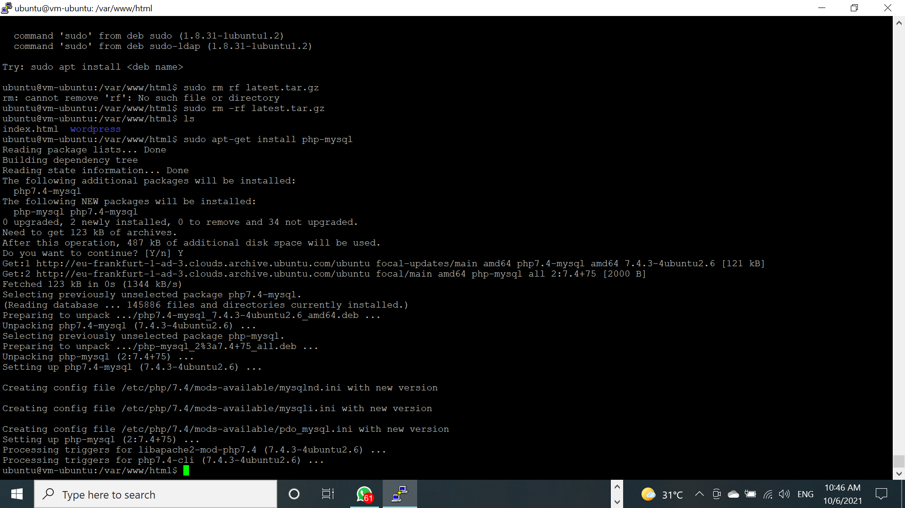
setelah itu buatlah file php dengan menggunakan perintah (sudo nano "nama file")
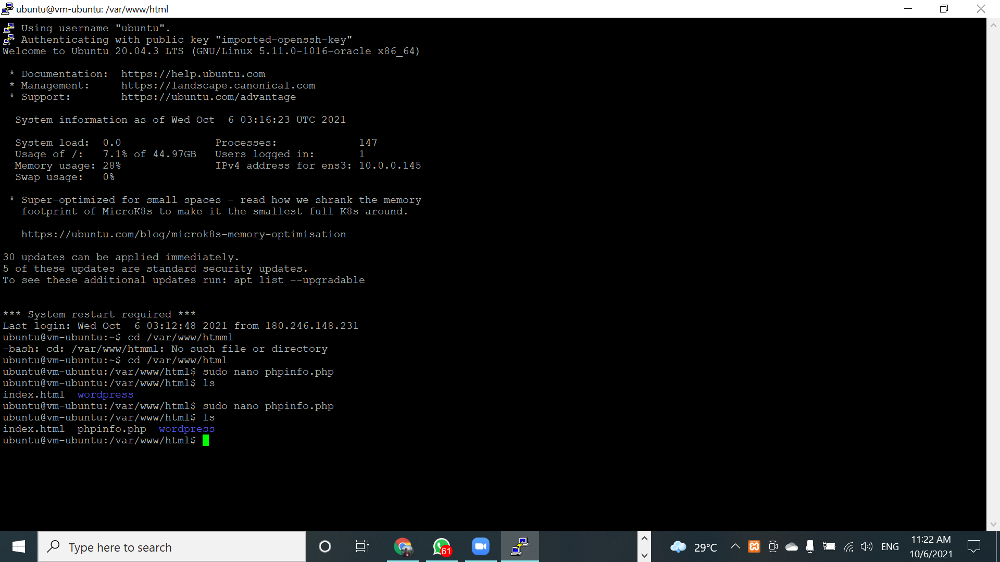
lalu isi file dengan perintah berikut:
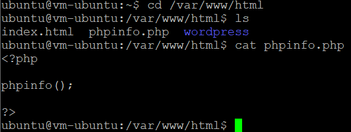
setelah itu ctrl+x lalu yes untuk keluar.
setelah keluar masuklah ke browser favorite anda lalu buka file tersebut dengan ip public vm anda:
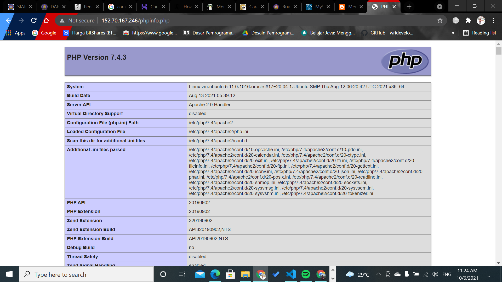
setelah itu kembali lagi ke terminal kesayangan anda lalu restart apache dengan menggunakan perintah berikut: (sudo service apache2 restart
sudo chown www-data:www-data -R *)

### Langkah 5
Selanjutnya lakukan instalasi wordpress degan menggunakan WEB BROWSER kesayangan anda dengn menuliskan ip public/wordpress:
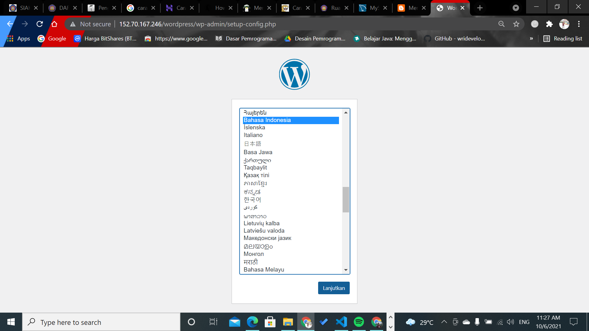
Lalu isi keterangan koneksi basisdata sesuai dengan gambar dibawah ini:
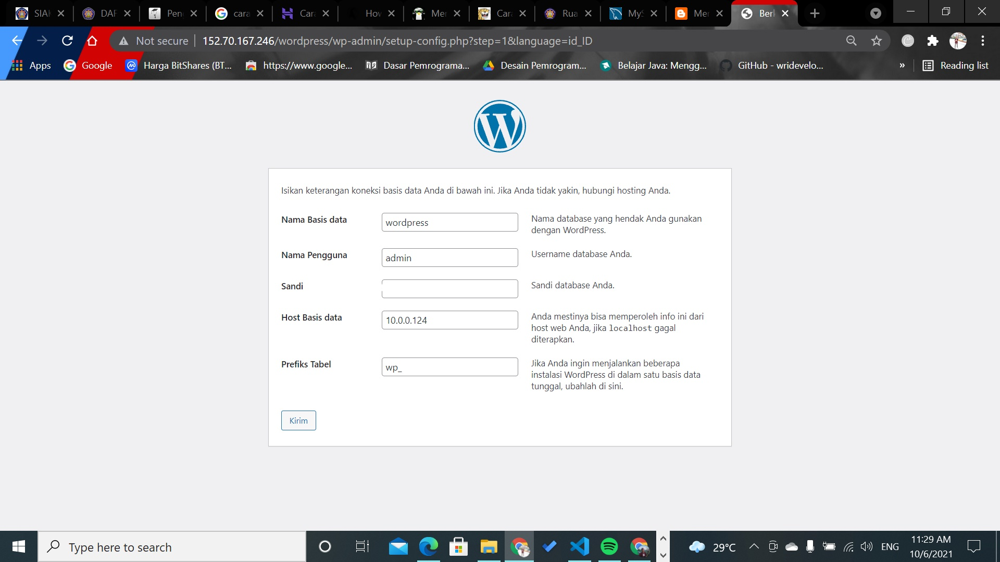
Setelah itu isilah informasi sesuai gambara dibawah ini:
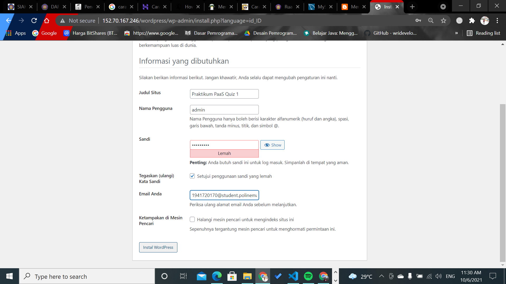
setelah mengisi informasi dan creating sukses maka akan tampil seperti gambar dibawah ini:
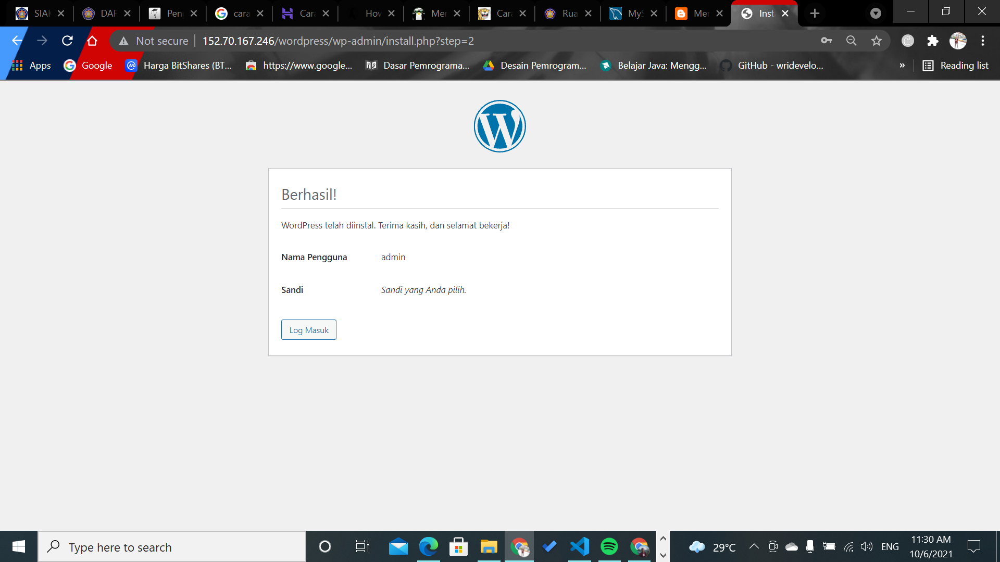
Lakukanlah percobaan login untuk memastikan creating anda berhasil, dengan mengisikan username dan password yang sesuai
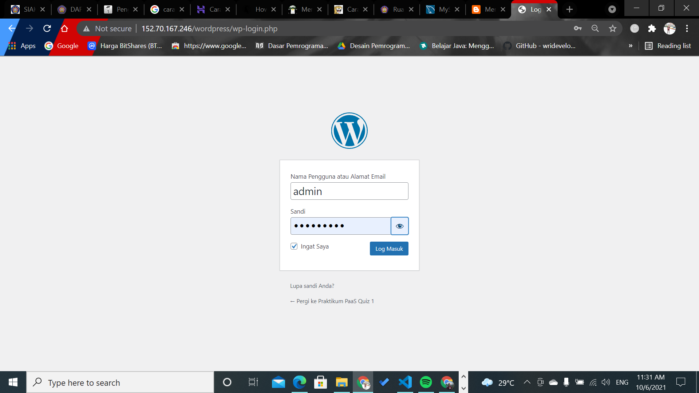
Jika tampil seperti gambar dibawha ini maka login anda berhasil dan anda sudah berhasil melakukan install wordpress dan berhasil melewati praktikum PaaS ini.
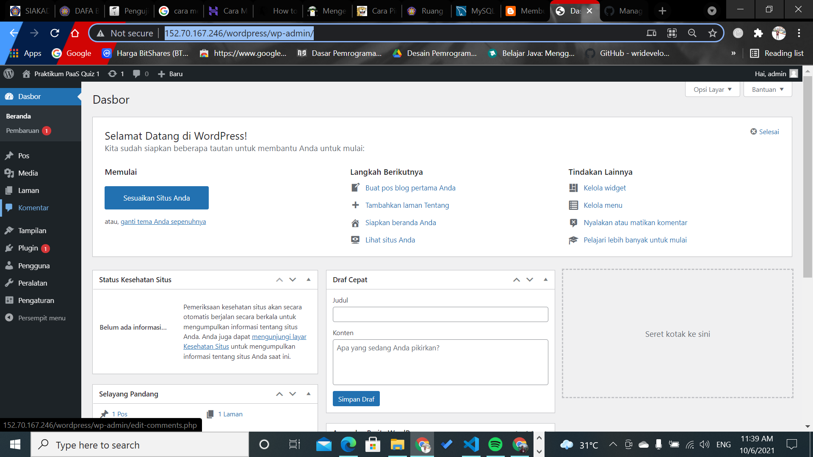