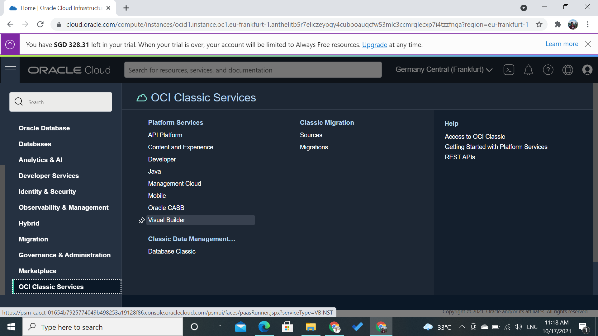
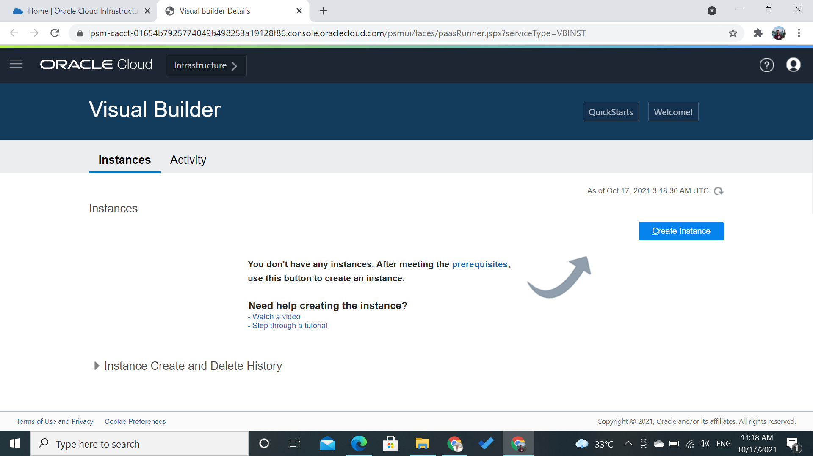
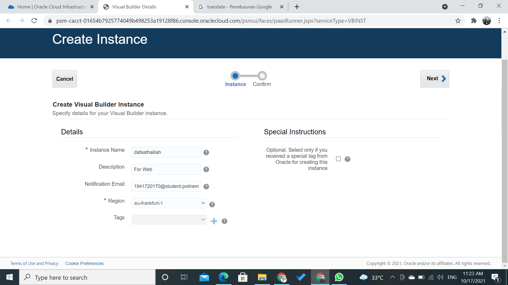

# 07 - Software as a Service (SaaS)

## Tujuan Pembelajaran

1. Mengetahui layanan Oracle Cloud Infrasturcture Software as a Service.
2. Mampu mengguankan layanan software layanan oracle.

# Hasil Praktikum

Berikut ini adalah dokumentasi praktikum SaaS.

---
## Praktikum
### Langkah 1
Membuat Aplikasi (Create Web Application) 
Login OCI -> Pilih OCI Classic Service -> Create Instace

### Langkah 2
setelah itu klik Create Instance:

lalu isi nama instance, nama, deskripsi dari instance, region dan tag sesuai dengan yang tertera pada jobsheet.

jika sudah mengisi form tersebut lalu klik create next dan 
akan tampil seperti ini : .png) 
jika sudah ter create instancenya akan tampil seperti ini:
.png)
.png)

### Langkah 3
Lihat pada pojok kiri, terdapat simbol menu (klik simbol tersebut dan akan muncul menu beriku), 
Kemudian pilih Open Visual Builder Home Page
.png)
Tunggu beberapa saat, kemudian jika berhasil akan muncul halaman berikut. Klik New Application
.png)
Lalu isi informasi tentang aplikasi yang akan dibuat dan klik finish:
.png)
Jika kita berhasil membuat akan muncul nama aplikasi yang akan kita buat seperti gabari dibawah ini:
.png)

### Langkah 4
1. Pada sisi kiri adalah menu dari (kotak berwarna merah) visual builder dari aplikasi yang akan kita 
buat, pilih ikon web kemudian akan muncul menu berikut : 
.png)
2. Pada dialog box Create Application, isi nama web dengan nama “hrwebapp” dan untuk novigation style biarkan none.
.png)
3. Expand hrwebapp, kita akan melihat struktur struktur dari aplikasi web, kurang lebih seperti gambar dibawah ini:
.png)

### Langkah 5 : Import Location Busines dari file
1. Klik Busines Object pada tab navigator:
.png)
2.  Klik tombol + Busines Object.
3. Pada dialog box Busines Object, isi field label dengan “Location” kemudian tekan tombol create (pada field name akan otomatis terisi).
.png)
4. Klik Field tab
.png)
5. Klik + Field untuk menambahkan Busines Object
6. Ketika pup-up box, masukan
    - Label: Name
    - Field Name: name (automatically populated)
    - Type: String String (selected by default)
.png)
.png)
7.  Pada property instpector, centang Required di bawah label constrain.
.png)
8.  Klik Menu icon dan pilih Data Manager (Data Manager bisa kita gunakan untuk mengimpor data dari berbagai sumber)
.png)
9. Pilih Impor From File.
.png)
10. Di kotak dialog Impor Data, klik kotak impor, pilih Location.csv, dan klik Impor. Ketika impor berhasil, klik Tutup.
.png)
.png)
11. di panel Bisnis Object, klik Location, lalu klik tab Data untuk melihat Location
.png)

### Langkah 6 : Department Business Object
1. Pada panel Business Objects, klik tanda +, lalu pilih Business Object.
2. Pada new Business Object dialog Box, Pada field label isi dengan “Department”.
.png)
3. Klik Fields tab kemudian klik + Field.
4. Pada pop-up box, masukan:
    * Label: Name
    * Field Name: name (automatically populated)
    * Type: String String icon (selected by default)
    * Click Create Field.
.png)
5. Pada property instpector, centang Required di bawah label constrain.
6. Klik Fields tab kemudian klik + Field
    * Label: Location
    * Field Name: location (automatically populated)
    * Type: Reference Reference icon
    * Referenced Business Object: Location(Reference field  seperti foreign key pada database table)
    * Display Field: Name (automatically populated)
.png)
.png)

### Langkah 7 : Employee Business Object
1. Pada panel Bisnis oject, klik tanda +, lalu pilih Bisnis Objek.
2. Pada new Business Object dialog Box, Pada field label isi dengan “Employee”.
.png)
3. Klik Fields tab kemudian klik + Field.
4. Pada pop-up box, masukan:
    * Label: Name
    * Field Name: name (automatically populated)
    * Type: String String icon (selected by default)
Click Create Field.
.png)
5. Pada property instpector, centang Required di bawah label constrain.
6. Pada property instpector, centang Required di bawah label constrain.
    * Label: Department
    * Field Name: department (automatically populated)
    * Type: Reference Reference 
    * Referenced Business Object: Department
    * Display Field: Name (automatically populated)
Klik Create Field.
.png)
7. Pilih + Fields, kemudian mauskan atau isi:
    * Label: Hire Date
    * Field Name: hireDate (automatically populated)
    * Type: Date Date 
Klik Create Field.
.png)
8. Pilih + Fields, kemudian mauskan atau isi:
    * Label: Email
    * Field Name: email (automatically populated)
    * Type: Email Email 
Klik Create Field, Di editor properti, Format diatur ke Email.
.png)
9. Klik tab Endpoints dan lihat API resource dan REST end point yang dibuat untuk Business Object
Empoyee. Karena Object Employee merujuk ke Department, kita dapat melihat end point untuk 
kedua objek terseut jika Anda memperluas node departmentObject. Perluas node Resource API 
untuk melihat URL untuk mengakses metadata dan data untuk objek bisnis, lalu perkecil lagi.
.png)
10. Di panel Objek Bisnis Navigator, klik tab Diagram, lalu klik tombol + busines object diagram.
.png)
11. Pada Create Business Object Diagram dialog box, isi field Diagram name dengan “HRDiagram”.
12. Pada properti inspector, pilih semua
.png)
.png)

### Langkah 8 : main-start Page untuk Display Departments
1. Pilih Web Applications pada tab navigator.
.png)
2.  Expand main nodes.
3. Perhatikan pada componen palette, tempatkan Heading komponen pada bagian common 
kemudian drag (heading) ke halaman.
4. Pada heading property inspector, isi text field dengan “ Departments” .
.png)
5. Pada components palette, scroll down sampai menemukan collection, pilih table, kemudian drop 
di bawah heading (departement).
6. Klik Add Data di Property Inspector untuk membuka Add Data Quick Stats
.png)
7. Pada halaman Quick Start, pilih busines object Departemen, lalu klik next.
.png)
8. Pada halaman Bind Data, di bawah item[i], centang id dan nama.
.png)
9. Perluas node locationObject dan item dan pilih name untuk mengaktifkan location name agar 
muncul di tabel. Klik next.
.png)
10. Pada halaman Query Page, klik Finish.
11. Untuk membuat kolom nama lokasi deskriptif, klik Data tab. dibawah Table (side menu bar 
sebelah kanan), klik ikon Detail arrow disebelah Name (locationObject)
.png)
12. Pada kolom, Header text field, ubah “Name” menjadi “Location”. Kemudian klik untuk kembali 
ke sub menu Data tab.
.png)

### Langkah 9 : Page untuk Department Business Object
Halaman create memungkinkan kita untuk mengisi tabel dengan data dengan membuat instance 
baru dari busines object.
1. Klik ta Quick Start (side menu sebelah kanan), kemudian klik Add Create Page.
2. Kemudian pada halaman End point, pilih busines object Department, kemudian pilih next.
3. Pada halaman detail page, dibawah endpoint structure, pilih dan centang location.
4. Isi field Button label dengan “Create”. Kemudian klik tombol Finish,
.png)
Setelah kita tekan tombol finish, akan muncul komponen tombol Create di atas tabel di halaman 
awal utama. Klik tab Web Application (side menu sebelah kiri) untuk melihat halaman maincreate-department yang berada dalam satu list main-start.
.png)
5. Klik main-create-department dan buka Page Designer. Pada halaman tersebut kita bisa melihat 
ada 2 filed sama seperti langkah ke-4. Selain itu terdapat 2 tomol Cancel dan Save.
.png)
6. Pada halaman Quic Preview klik Live, pada mode ini kita bisa mencoba apakah form yang kita 
buat sudah berjalan atau tidak.
7. Pada field Name ise dengan “Administration” dan untuk lokasi pilih Floor 1.
.png)
Kemudian klik Save, maka akan muncul pesan dan Oracle Visual Builder akan mengarahkan kita
ke halaman flow diagrarm dari halaman yang kita buat.
.png)
8. Buka, halaman main-start, bisa kita lihat data pada tabel telah ditambahkan.
.png)

### Langkah 10 : Menambah Halaman Display Employees
Pada bagian ini, Kita akan membuat halaman untuk menampilkan Employee, prosesnya mirip dengan
pada langkah sebelumnya (membuat halaman departement).
1. Pada main klik simbol + pada main node.
2. Pada dialog box Creating Page, masukkan " employees” setelah prefix main-, kemudian klik 
create.
.png)
3. Kemudian tambahkan Heading pada halaman main-employess, dengan cara melakukan drop 
komponen heading ke halaman main-employess.
4. Ganti filed text pada side menu (sebelah kanan) properties Heading dengan “ Employees”
5. Kemudian tambahkan komponen Table pada halaman main-employess.
6. Klik Add Data.
7. Pada menu pop-up add data, pilih busines object Employee, kemudian pilih next.
8. Untuk filed data pilih id, name, hireDate, dan Email.
.png)
9. Expand departmentObject -> item nodes, pilih name, kemudian pilih next.
10. Kita bisa melewat halaman Define Quire, pilih Finish.
11. Kembali ke menu properties pilih tab Data, dibawah table column name (paling bawah) klik 
pada field columnt header text isi dengan ” Department”.
12. .Klik untuk kembali ke Data tab.

### Langkah 11 : Halaman Create untuk Employee Busines Object
1. Quick Stari, klik Add Create Page.
.png)
2. Pilih end point Employee.
3. Untuk filed pilih hireDate, email, dan departement (name otomatis dipilih karena required field).
4. Pada field Button Lable isi dengan Create, klik finish.
.png)
5. Klik live, kemudian masukan data name: Lasile Smith, Hire Date: (today), email: 
lsmith@example.com Departmet: Administration. Kemudian pilih Save. Setelah itu kita akan 
diarah ke halaman Page Flow. Ketika kita kembali ke halaman main-employess akan tampil data 
yang telah kita isikan (jika tidak tampil klik tombol reload page ).
.png)
.png)
.png)
6. Klik Code untuk melihat kode HTML dari halaman main-employess.
.png)
7. Klik Design untuk kembali ke halaman main-employees, kemudian klik Structure
8. Klik Structure lagi untuk menutup structure view.

### Langkah 11 : Mengganti Nama Halaman main-start
1. Pada Side menu (Web Apps) klik kanan pada main-start, kemudian pilih rename.
.png)
.png)
2.  Pada pop-up menut, pada filed ide Ganti nama start dengan departments, sehingga akan menjadi 
seperti:
3. Double klik pada main-departments.
4. Klik Source View expand webApps, hrwebapp, flows, dan main nodes. Kemudian klik mainflow.jso
.png)
### Langkah 12 : Action Chain halaman Departments ke halaman Employess
1. Tambahkan Button pada halaman main-departments, beri nama botton “Dispalay Employee”.
2. klik + New Event (side bar properties), pilih Quick Start: ‘ojAction’, setelah di klik sebuh action 
chain akan dibuat dengan nama ButtonActionChain, berisi Start action.
.png)
3. Drag Navigate action dari Navigation section yang ada di Action Palatte ke tanda + dibawah 
action start.
4. Pada Navigate Property insptector, Pada filed Target pilih main-employees.
5. Klik Preview . di header untuk menguji halaman dan navigasi. Applikasi akan membuka 
browser tab yang lain, click Crate dan tambahkan data departemetn (contoh: IT -> Floor 2). 
Kemudian klik Save.
.png)
.png)
.png)
.png)
.png)
.png)

6.  Klik Display Employees Page, kemudian klik Create. Tambahkan data employee sesuatikan 
dengan nama departemet yang baru dibuat.

### Langkah 13 : Action Chain halaman Employess ke halaman Departments
1. Untuk proses action chain halaman employees ke halaman departments sama dengan pada langkah 
sebelumnya, berinama tombol “Display Departments”. Untuk Navigate Page “Navigate maindepartments”. 
2. Klik Preview .
3. Klik main -> Page Flow.

### Langkah 14 : Import Data ke Busines Object
1. Pada Navigator, Pilih tab Busines Object , kemudian klik Object tab.
2. Klik Departement kemudian klik Data tab, kemudian akan tampil jenis object yang telah kita 
buat tadi.
3. Klik Import from File .
4. Pada dialog-box import data, pilih Replace untuk Row Handling jika belum dipilih. Kemudian 
klik upload box, browse, pilih file Departement.csv dan klik Import.
.png)
5.  Ulangi langkah yang sama (langkah 1-4) untuk import data Employee menggunakan file 
Employee.csv.
.png)

### Langkah 15 : Halaman Edit Department Busines Object (data manipulation)
1. Pada aplikasi HR Application, tab Web Application pilih halaman main-departments -> 
Page Designer. Klik Reload Page jika diperlukan, untuk menampilkan update halaman 
terbaru (setelah import data). 
2. Klik komponen table yang ada di halman main-departments, kemudian pada properties (side
menu sebelah kanan) pilih Quick Start, klik Add Edit Page.
.png)
3. Untuk halaman end point, pilih business object Department, kilik Next.
4. Untuk update end point, pilih businees object Departmetn, kemudian klik Next.
5. Pada halaman Page Details, pilih location dibawah struktur Endpoint (name otomatis akan 
dipilih), klik Finish. Tombol Edit Department akan tampil pada halaman main-department, tetapi 
halaman tersebut masih belum aktif. 

### Langkah 16 : Halaman Detail untuk Department Busines Object
1. Pilih Quick Start menu, klik Add Detail Page.
2. Pilih halaman end point business object Department, 
3. Pada Page Detail, pilih name dibawah EndPoint Structure, expand locationObject dan items
(item[i]) pilih name, klik Finish. Tombol Department Detail akan ditampilkan pada toolbar 
yang ada pada halaman main-department, untuk saat ini tombol tersebut masih belum aktif
4. Klik Live, pilih data (terserah), klik tombol Departement Detail untuk membuka halaman maindepartment.
5. Klik Design untuk kembali ke mode Desain.
6. Klik main-department-detial, pilih Name (paling bawah), ganti label menjadi Location
(Properties -> General -> Label Hit)

### Langkah 17 : Halaman Delete untuk Department Busines Object
1. Kembali ke halaman main-department, klik Quick Start kemudian klik Add Delete Action.
2. Pilih Endpoint busines object Department, 
3. Tombol Delete Department akan ditampilkan pada toolbar, kondisi tombol akan berada pada 
inactive.

### Langkah 18 : Test Fungsi Halaman Department Busines Object
1. Lakukan test pada setiap tombol yang telah Anda buat dengan menggunakan mode review.
2. Cobalah menambahkan Data, Update, dan menghapus data.
.png)
.png)
.png)
.png)
.png)

### Langkah 19 : Employee Business Object
1. Tambahkan halaman edit, detail dan delete pada halaman busines object Employee.
2. Preses pembuat halaman sama dengan langkah sebelumnya, Pilih Quick Start (Add Edit Page dan 
Delete Action Page.
3. Untuk page details pada busines object employee pilih name (otomatis dipilih) hireDate, email
dan department.
4. Set agar tampilan pada halaman Edit employe menjadi seperti ini (2 row):
.png)
Pilihan halaman main-edit-employee -> klik formlayout yang ada pada halaman -> Properties -> 
General -> set Max Columns 2.
5. Untuk field detal page pilih name, hireDate, email. Expand departmentObject -> items -> 
name. Klik Finish.
6. Ganti label name (yang ke dua/paling bawah) pada halaman Employee Detail menjadi 
Department (Properties-> General -> Label Hint).
.png)
7. Tambahkan halaman Delete Employee dengan menggunakan objct busines Employee, sehingga 
tampilan akhir dari main-employee menjadi seperti dibawah ini:
.png)

### Langkah 20 : Test Fungsi Halaman Employee Busines Object
1. Lakukan test pada setiap tombol yang telah Anda buat dengan menggunakan mode review.
2. Cobalah menambahkan Data, Update, dan menghapus data.
.png)

--- 

# Stage and Publish
### Langkah 21 : Stage
1. Kembali ke halaman utama Visual Builder.
2. Pada aplikasi yang telah dibuat klik Options , kemudian select Stage.
3. Pada popup-box pilih Populate Stage with Development data kemudian klik Stage.
.png)
Application stage berubah dari development ke stage.
.png)
4.  Klik Stage, pilih hrwebapp (nama apliaksi web yang kita buat). Setelah kita klik akan membuka 
tab baru pada web browser yang kita gunakan. Pada halaman yang baru dibukan akan ada data 
yang kita tambahkan pada saat development.
.png)

### Langkah 21 : Publish Application
Setelah kita berhasil menguji aplikasi pada tahab sebelum, kita dapat mempublikasikannya dan 
membuat aplikasi live. Aplikasi langsung dapat dilihat oleh pengguna dengan kredensial yang tepat.
1. Klik ikon menu dan select Publish.
2. Pada pop-up box select Include data from Stage dan klik Publish.
.png)
3. Klik OROCLE Visual Builder untuk kembali Visual Applications page.
4. Klik Live dan pilih hrwebapp. Aplikasi akan membuka tab browser baru.
.png)
Data akan secara otomatis terisi dengan data saat kita melakukan stage, tetapi jika ingin memulai 
aplikasi dengan database yang kosong kita bisa memilih Publish application with a clean 
database.
5. Catat link dari aplikasi yang telah kita buat, dari link tersebut kita membagikannya ke Public User.

---

# TUGAS
### Langkah 1
Create page salary terlebih dahulu lalu sebuah fields dengan nama salary type number dan satu field lagi bernama department dengan type reference ke departments.
.png)
.png)
### Langkah 2
lalu setelah itu cek diagramnya pastikan salary sudah berelasi dengan departments
.png)

### Langkah 3
pada web application buatlah sebuah page bernama "Main-Salary"
.png)

### Langkah 4
Setelah itu lakukan add data seperti pada praktikum di atas dengan end points seperti dibawah ini: 
.png)

### Langkah 5
lalu buatlah sebuah create page sperti pada praktikum di atas dengan end points seperti dibawah ini:
.png)

### Langkah 6
lalu buatlah sebuah edit page sperti pada praktikum di atas dengan end points seperti dibawah ini:
.png)

### Langkah 7
lalu buatlah sebuah detail page seperti pada praktikum di atas
.png)
.png)
.png)

### Langkah 8
Lalu buatlah delete action seperti pada praktikum di atas
.png)
.png)
.png)

### Langkah 8
pada main employees tambahkan sebuah button action menuju main-salary dengan nama display salary:
.png)
.png)

### Langkah 9
Lakukan testing pada button employees apakah sudah bekerja dengan sesuai:
.png)
.png)

### Langkah 10 
Stage kembali applikasi.
.png)
.png)
### Langkah 11
duplicate applikasi lalu publish dan pastikan status applikasi sudah live:
.png)
.png)

---
# Praktikum dan Tugas Sudah Selesai | Terimakasih