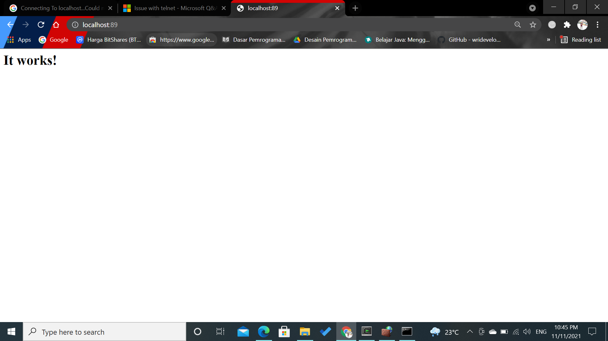

# 11 - Docker2

## Tujuan Pembelajaran

1. Mahasiswa dapat mengetahui secara jelas network di Docker
2. Mahasiswa mengetahui konsep volume pada Docker
3. Mahasiswa mampu memanfaatkan dan menggunakan volume ataupun network ketika build image docker.
4. Mahasiswa bisa menggunakan docker compose dalam pembuatan aplikasi.

# Hasil Praktikum

Berikut ini adalah dokumentasi praktikum Docker2.

---
## Praktikum 
### Langkah 1
Pertama ketik perintah di bawah ini untuk mengetahui network yang tersedia pada docker host kita

### Langkah 2
Untuk membuat network bisa menggunakan perintah create seperti pada gambar di bawah ini

Selanjutnya cek network yang sudah dibuat menggunkan perintah ls, seharusnya akan menambahkan network. Hasilnya adalah sebagai berikut

### Langkah 3
Terakhir, ketika ingin mengetahui informasi detail dari network yang telah kita buat bisa menggunakan perintah inspect

### langkah 4
#### Menghubungkan Container ke Network
Buat terlebih dahulu contoh container, misalkan kita akan membuat container linux yaitu busybox.

Buat container yang kedua menggunakan image linux alphine, buka windows yang baru agar container1 tetap berjalan

Jangan lupa mengubah nama container dari yang sebelumnya.
Kemudian cek masing-masing container tersebut menggunakan perintah ps untuk mengetahui status container yang sedang jalan. Buka windows baru, jalankan perintah berikut

Kemudian jalankan inspect untuk mengetahui informasi detail dari masing-masing container
jalan. Buka windows baru, jalankan perintah berikut
 
Untuk membuktikan silakan ping dari container1 ke container2, seharusnya akan reply.

 
### Langkah 5
#### Membuka Port Container
Misalkan kita ingin membuat image dari apache, layanan httpd. Bisa dilakukan dengan perintah di bawah ini

Atau Anda bisa ngetik pada browser seperti ditunjukkan di bawah ini

Kemudian untuk mengetahui port yang dilakukan expose pada container, bisa menggunakan perintah di bawah ini

### Langkah 6
#### Membuat Volume
Selanjutkan jalankan perintah dengan menambahkan parameter -v seperti berikut untuk mapping ke container yang akan kita buat, jangan lupa untuk masuk direktori volume, dan membuat file log.txt
