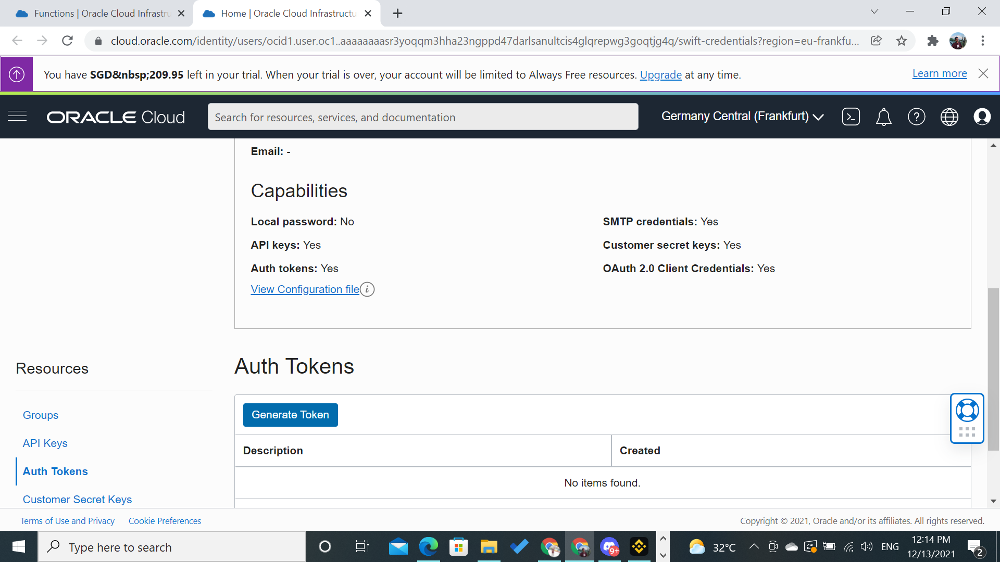

# 13 - Serverless

## Tujuan Pembelajaran

1. Mahasiswa dapat mengetahui secara jelas Mengenai Serverless

# Hasil Praktikum

Berikut ini adalah dokumentasi praktikum Serverless.

---
## Praktikum 
### Langkah 1
Masuk ke akun https://cloud.oracle.com dan navigasi ke menu Developer Services -> Applications

### Langkah 2
Tekan tombol Create Application dan lengkapi informasi form Name dengan hello-app. Lengkapi juga VCN dan subnet yang dibutuhkan. Jika anda belum mempunyai VCN, silahkan membuat terlebih dahulu VCN.

### Langkah 3
Tekan tombol create dan tunggu sampai muncul halaman Getting Started.

### langkah 4
Pada halaman Getting Started terdapat contoh langkah-langkah deploy menggunakan perintah fn. Terdapat dua pilihan deploy, melalui Cloud Shell Setup atau Local Setup.

### Langkah 5
Aktifkan Cloud Shell dengan menekan tombol Launch Cloud Shell. Tunggu proses provisioning cloud shell selesai. Anda akan mendapatkan sebuah terminal built-in yang dapat digunakan untuk melakukan proses deployment.

### Langkah 6
Ikuti langkah-langkah dengan melakukan copy perintah kemudian tempelkan ke dalam terminal Cloud Shell.

setelah itu kita melakukan update:

setelah melakukan update jalankan perintah di bawahh:

lalu pada langkah ke 5 bagian cloud shell lakukan generate token, dan lakukan login:

lalu jalankan perintah langkah ke 6 seperti gambar di bawah ini:

setelah itu jalankan perintah seperti gambar di bawah:

lalu lakukan pembutaan folder hello-java seperti gambar dibawah ini:

lalu masuk kedalam direktori hello-java yang baru kita buat tadi

lalu lakukan langkah untuk men deploy seperti gambar dibawah ini:

lalu lakukan langkah invoke seperti gambar dibawah ini:

selanjutnya lakukan pemanggilan function:

---

## Tugas

### Langkah 1
Lakukan pembuatan application terlebih dahulu:

### Langkah 2
Lakukan cloning github dari link yang sudah di sediakan pada jobsheet:

### Langkah 3
lalu masuk kedalam direktori github yang sudah kita clone lalu ketikkan LS untuk mengetahui apa saja yang ada di dalam direktori tersebut:

setelah itu lakukan deploy seperti pada praktikum di atas hanya saja perlu melakukan penyesuaian sesuai dengan contoh function yang kita pilih: 

### Langkah 4
Lakukan invoke:
