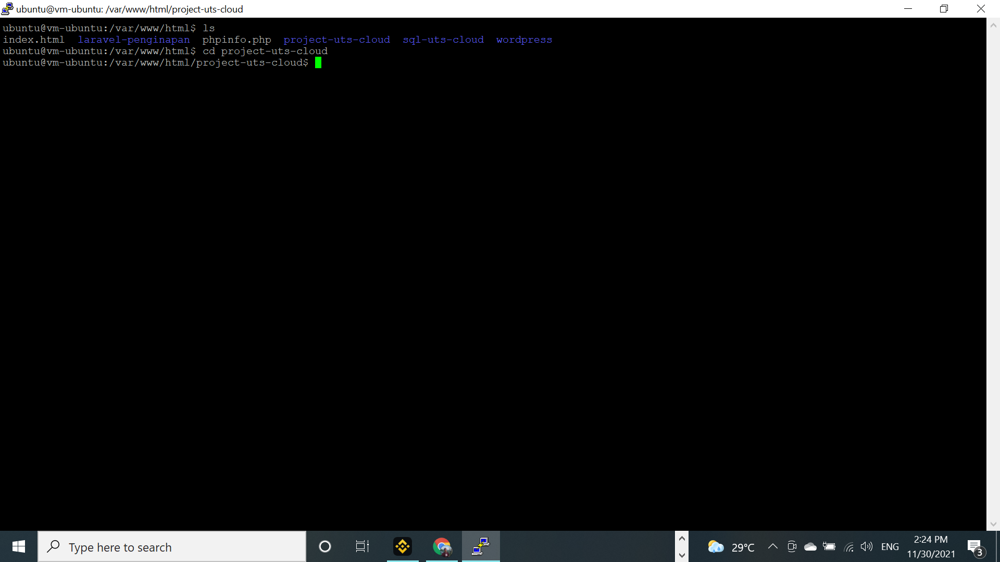
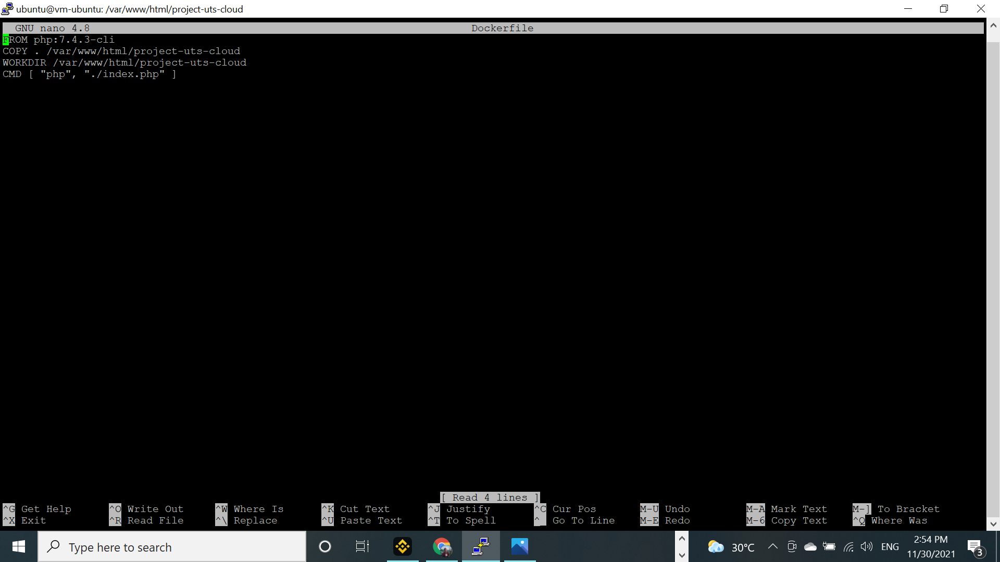
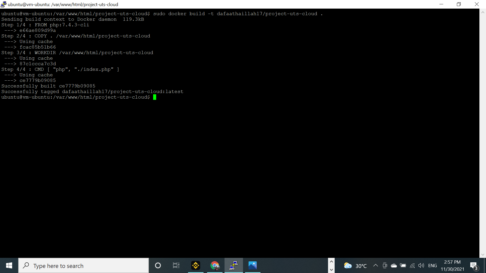
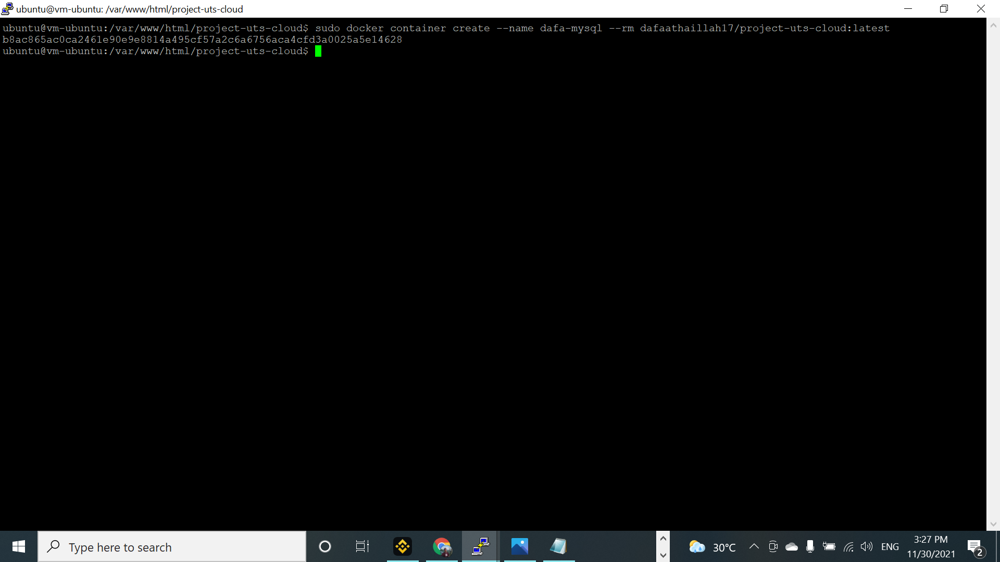
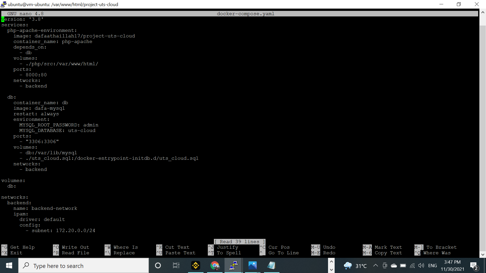
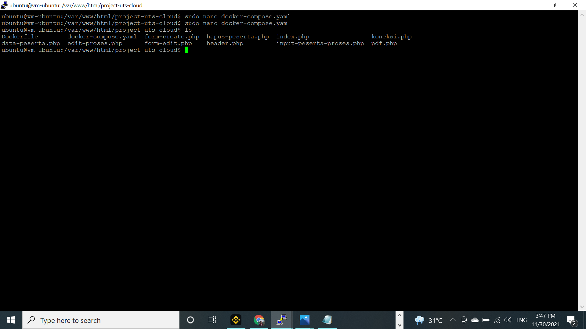
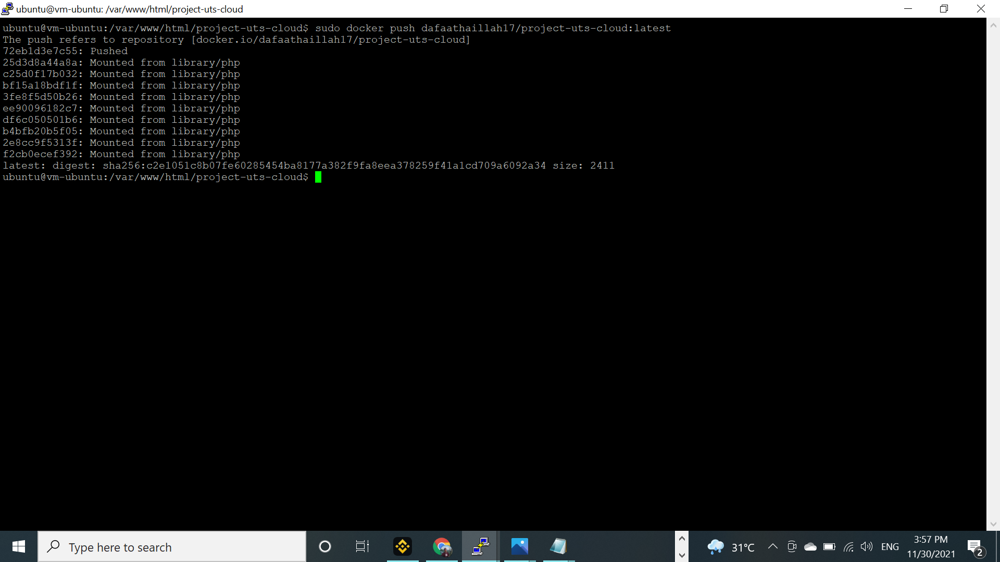
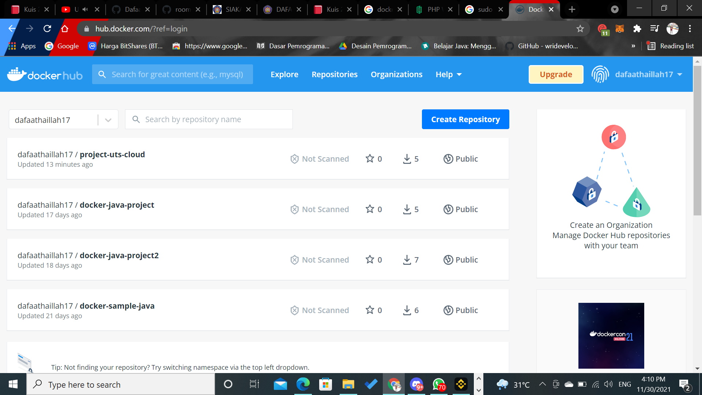

# 14 - QUIZ 2 CLOUD COMPUTING

### Langkah 1
Masuk ke dalam VM lalu masuk ke dalam folder project UTS seperti gambar di bawah ini :

### Langkah 2
Selanjutnya buatlah sebuah file bernama Dockerfile dan isilah file tersebut seperti gambar dibawah ini:

### Langkah 3
Selanjutnya build project uts dengan menuliskan perintah seperti gambar berikut:

### Langkah 4
Lalu buatlah sebuah container untuk project uts seperti gambar dibawah ini:

Lalu buat lagi sebuah container untuk databasenya:

### Langkah 5
Setelah membuat container buatlah sebuah file dengan nama docker-compose ber ekstensi YAML lalu isikan file tersebut seperti gambar dibawah ini:

lalu cek apakah docker-compose dan file Docker sudah terbuat, untuk mengeceknya ikuti seperti gambar dibawah ini;

### Langkah 6
Lalu push project dengan menggunakan printah seperti gambar dibawah:

setelah itu masuklah kedalam repository anda di docker hub dan pastikan project sudah ter push seperti gambar dibawah ini:

---

# QUIZ COMPLETE | Terimakasih 